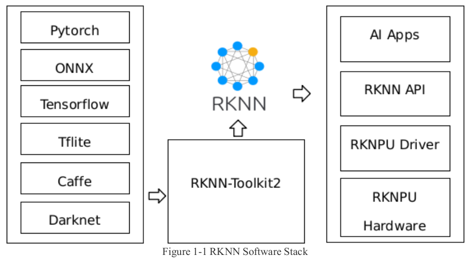
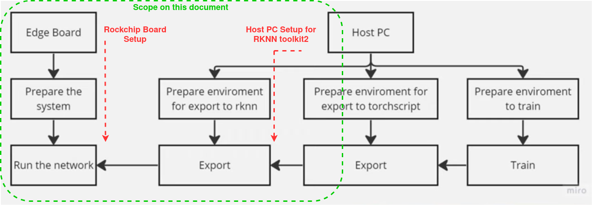
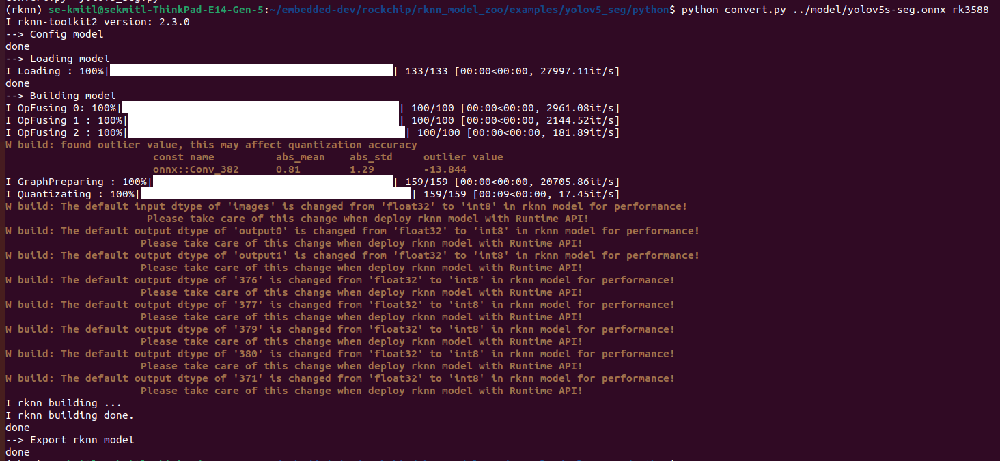
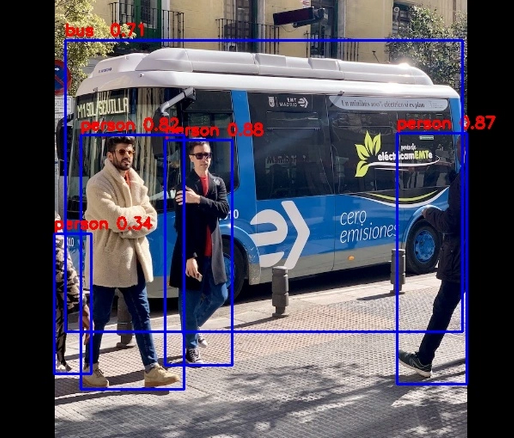
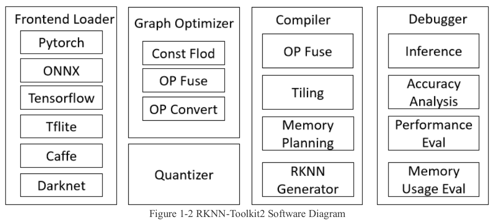

### Rockchip repositories for NPU
 <br>

The official rockchip repository of RKNN tools for the AI applications with NPU can be found in here: <br>
https://github.com/airockchip/rknn-toolkit2/tree/master
The RKNN toolkit consists of:
- RKNN Toolkit 2 for x86_64 Host PC as the Model Quantizer, Optimizer and Compilier
- RKNN Toolkit Lite 2 for Rockchip board as the inference device

 <br>

Official rockchip repository of RKNN pre-built models and the benchmark results can be found in here: <br>
https://github.com/airockchip/rknn_model_zoo 


### Host PC setup for exporting the rknn model
Prerequisite: Host PC should be x86 Linux (Debian-based Linux). ARM64 Processor may not guarantee to work.

1. Download rknn-toolkit2 and rknn-model-zoo to the host PC. The size of rknn-toolkit2 is quite big and it will take sometime to download completely.
```
cd /path/to/rknn
git clone -b v2.3.0 https://github.com/airockchip/rknn-toolkit2.git
git clone -b v2.3.0 https://github.com/airockchip/rknn_model_zoo.git
```

2. Install rknn-toolkit2
Warning, please select the appropriate requirements file and wheel installation based on your Python version. 
Here it is for python3.8
```
cd rknn-toolkit2/rknn-toolkit2/packages/x86_64/
pip3 install -r requirements_cp38-2.3.0.txt
pip3 install ./rknn_toolkit2-2.3.0-cp38-cp38-manylinux_2_17_x86_64.manylinux2014_x86_64.whl
```

3. Download RKNN Model Zoo on the host PC for a pre-trained model usage later. 
```
git clone -b v2.3.0 https://github.com/airockchip/rknn_model_zoo.git
```
Host PC needs to convert the model with rknn-toolkit2 for the board in order to use it in inferencing. We could use this pre-trained models for testing.


### Rockchip board setup for inferencing the exported model
1. Enable NPU overlay (Only for some rockchip board / old OS image). For an official Radxa image, 
   it has RKNPU2 and has already enable the NPU overlay + dependencies installation by default. Try this if something doesn't work:
```
sudo apt update
sudo apt install rknpu2-rk3588
sudo reboot
```

2. Check RKNPU2 driver
By using `dmesg`
```
sudo dmesg | grep "Initialized rknpu"
[   15.522298] [drm] Initialized rknpu 0.9.6 20240322 for fdab0000.npu on minor 1
```
By checking version at /sys/kernel/debug/rknpu
```
sudo cat /sys/kernel/debug/rknpu/version
RKNPU driver: v0.9.8
```

3. Install RKNN Toolkit Lite2
```
sudo apt update
sudo apt install python3-rknnlite2
```

4. Install rknn_toolkit-lite2 Python API in a virtual environment on the board.
Start from the Host PC
```
cd /path/to/rknn-toolkit2
cd rknn-toolkit-lite2/packages/
```
Then, copy the corresponding rknn_toolkit_lite2-2.3.0-cp3X-cp3X-manylinux_2_17_aarch64.manylinux2014_aarch64.whl to the board based on the Python version of the board system.
In board, to activate the venv:
```
pip3 install ./rknn_toolkit_lite2-2.3.0-cp3X-cp3X-manylinux_2_17_aarch64.manylinux2014_aarch64.whl
```

Testing the python environment on the board
```
$ python3
>>> from rknnlite.api import RKNNLite as RKNN
```

5. Download RKNN Model Zoo on the Rockchip board to use the example of inference code. 
```
git clone -b v2.3.0 https://github.com/airockchip/rknn_model_zoo.git
```


### Testing RKNN on the Rockchip board
Rockchip provides the Python examples on how to convert the model into .rknn model file for the inferencing and interence with the converted model.
We will use YOLOv8 example for this guideline.

1. On host PC, convert the ONNX or Pytorch model of YOLOv8 in RKNN Model Zoo.
```
cd rknn_model_zoo/examples/yolov8
cd model
bash download_model.sh
cd ../python
python convert.py ../model/yolov8n.onnx rk3588
```
the output model will be stored in /model as the same folder of input ONNX model, named `yolov8n.rknn`
 <br>

2. Copy `yolov8n.rknn` to the Rockchip board at the same location in RKNN Model Zoo.
Example, SCP command will be used to copy a file.
```
scp ../model/yolov8n.rknn username@ip:~/rknn_model_zoo/examples/yolov8/model
```

3. On Rockchip board, inference the converted model with RKNN python API
```
cd rknn_model_zoo/examples/yolov8/python
python yolov8.py --model_path ../model/yolov8n.rknn --target rk3588 --img_show
``` 
 <br>

The resulted image with object detection box from YOLOv8 will be shown in `result/bus.jpg`. Tested image(s) can be changed by using `--img_folder` with `yolov8.py` \
For more examples, find more on the `rknn_model_zoo` repository.


### More detail on RKNN toolkit2 optimization, quantization and compilation process
See at document "02_Rockchip_RKNPU_User_Guide_RKNN_SDK_V2.3.0_EN.pdf" `on rknn-toolkit2/doc`
 <br>


### RKNN optimization for exporting model YOLOv8
https://github.com/airockchip/ultralytics_yolov8/blob/main/RKOPT_README.md


